# Deterministic Neural Network ASIC Accelerator in 45nm CMOS for ISO 26262 ADAS (AEB / AES)

[](#silicon-physical-implementation-cadence-flow)
[](#silicon-physical-implementation-cadence-flow)
[](#verification--simulation-results)
[](#cycle-breakdown--iso-26262-determinism)
[](#license)

Hardware implementation of a memory-bound Artificial Neural Network (ANN) accelerator tailored for Autonomous Emergency Braking (AEB) and Autonomous Emergency Steering (AES) systems. Designed, simulated, synthesized, and placed-and-routed down to the GDSII physical layout in 45nm standard CMOS technology.

<p align="center">
  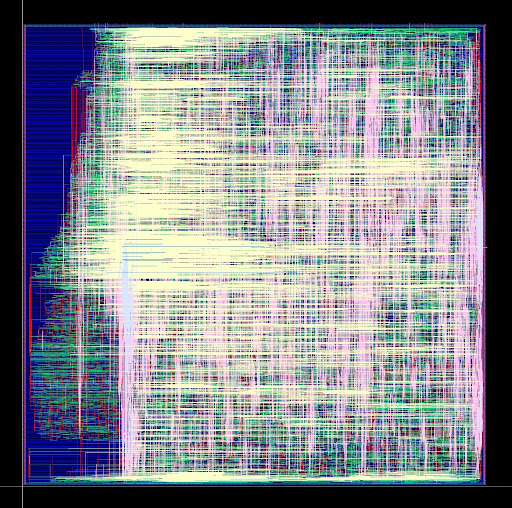
  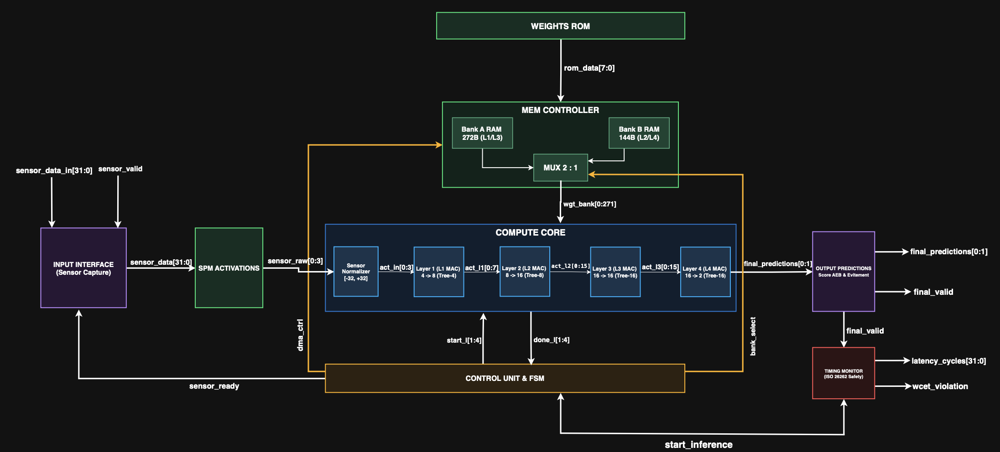
</p>

---

## Key Hardware & Physical Highlights (Sign-off)

* **Bounded Determinism:** End-to-end execution latency strictly locked at **467 clock cycles** ($0\text{ ps}$ jitter).
* **Ultra-Fast Emergency Reflex:** $6.42\ \mu\text{s}$ decision time at $72.67\text{ MHz}$ ($9.34\ \mu\text{s}$ at $50\text{ MHz}$ nominal).
* **Zero Braking Distance Penalty:** Vehicle travels only **$0.21\text{ mm}$** at $120\text{ km/h}$ during inference processing.
* **High-Density Silicon Implementation:** **$98.426\%$** core density over a $1.008\text{ mm}^2$ die ($444,158$ equivalent logic gates).
* **Low Power Footprint:** Total dissipation of **$43.66\text{ mW}$** at $50\text{ MHz}$ ($1.08\text{ V}$, slow corner, $125^\circ\text{C}$) with only $15.97\ \mu\text{W}$ leakage.
* **Full Timing Closure:** Worst Negative Slack (WNS) setup = **$+6.239\text{ ns}$**, WNS hold = **$+0.049\text{ ns}$**, balanced clock skew = **$60.1\text{ ps}$** across $18,310$ sinks.
* **Physical Integrity:** **$0\text{ DRC violations}$**, **$0\text{ LVS open/shorts}$**, **$0\text{ process antenna errors}$**[cite: 19, 22].

---

## Architectural Overview

<p align="center">
  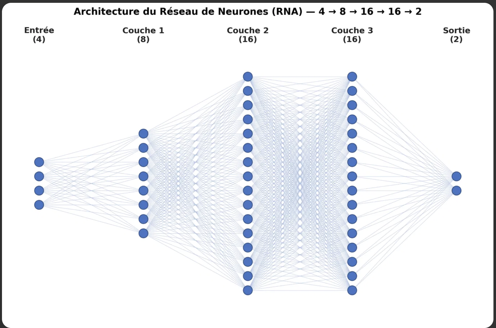
</p>

### Neural Topology & Arithmetic
* **Configuration:** Multi-Layer Perceptron (MLP) with $4 \to 8 \to 16 \to 16 \to 2$ dense layers ($490$ parameters total).
* **Input Layer (4 Sensors):** Distance $d \in [2, 100]\text{ m}$, Ego speed $v \in [10, 120]\text{ km/h}$, Azimuth angle $\theta \in [-30^\circ, +30^\circ]$, Relative speed $v_{rel} \in [-33, +33]\text{ m/s}$.
* **Hidden Layers (L1, L2, L3):** Pipelined affine dot-products followed by hardware clipped ReLU activation: $\text{act} = \text{clip}(\max(0, S \gg 5), 0, 31)$.
* **Output Layer (L4):** Raw linear activation outputs without saturation, exposing direct continuous driving dynamics (`Score AEB`, `Score Steering`).
* **Quantization Scheme:** Uniform INT8 symmetric mapping with power-of-two scale factor $S = 32.0$ ($Qx.5$ fixed-point arithmetic). Multiplication/division scaling is implemented with purely hardwired bit shifts (`<<< 5` and `>>> 5`), eliminating division circuits on silicon.

---

## Datapath & Memory Hierarchy

The compute fabric resolves the classical memory-bound penalty of neural accelerators using spatial computing and asynchronous double buffering.

<p align="center">
  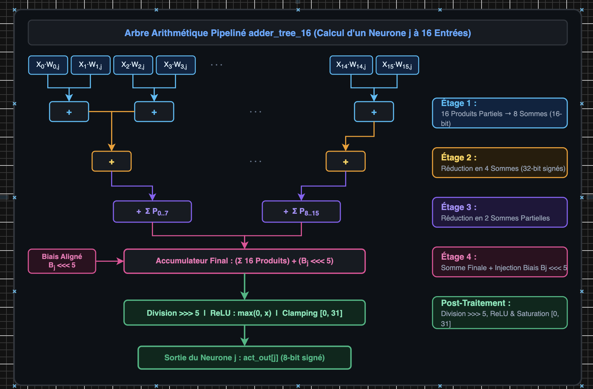
  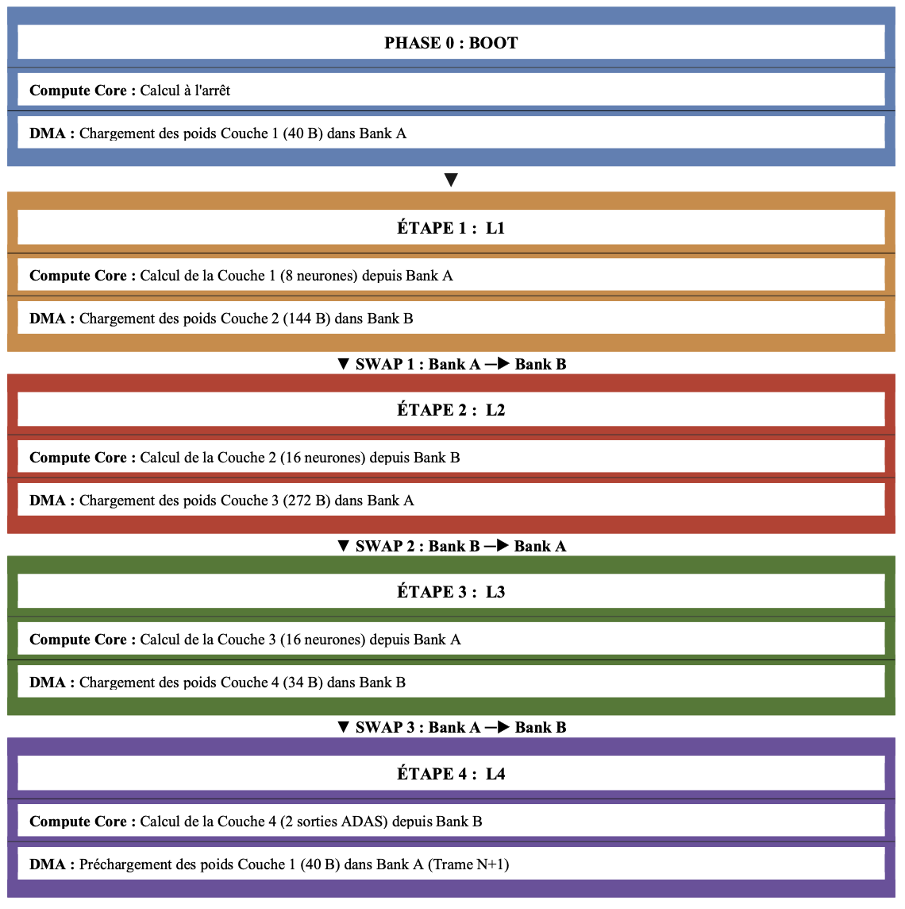
</p>

### Tree-MAC Compute Engine
Instead of looping over MAC units, the core features dedicated spatial tree structures:
* **`adder_tree_4.sv`:** 4 signed INT8 multipliers with 2-stage Carry-Save Reduction (Couche 1).
* **`adder_tree_8.sv`:** 8 parallel multipliers with 3-stage pipelined binary tree (Couche 2).
* **`adder_tree_16.sv`:** 16 parallel signed multipliers ($8 \times 8 \to 16\text{ bits}$), reducing products through a 4-level balanced Carry-Save Adder (CSA) adder tree directly into 32-bit signed accumulators to completely eliminate intermediate arithmetic overflow.

### Ping-Pong Memory Subsystem (`mem_controller.vhd`)
* **Local SRAM Bank A ($272\text{ Bytes}$):** Serves odd layers (L1 & L3).
* **Local SRAM Bank B ($144\text{ Bytes}$):** Serves even layers (L2 & L4).
* While `compute_core.sv` calculates layer $N$ using active bank weights, a dedicated DMA channel fetches layer $N+1$ coefficients from `weights_rom.sv` in the background. Memory latency is completely hidden without runtime stalls.

<p align="center">
  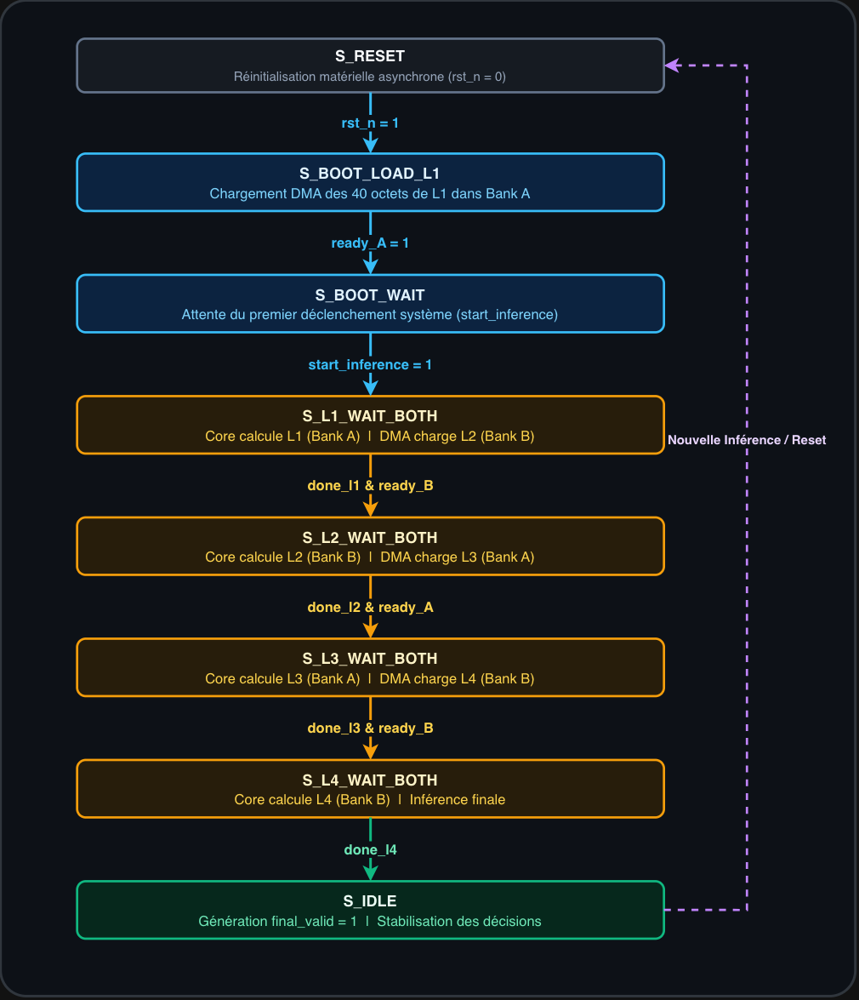
</p>

---

## Cycle Breakdown & ISO 26262 Determinism

Execution latency across each finite state machine step is fully invariant:

| Pipeline Step | FSM State | Computation (`compute_core`) | Concurrent Memory DMA | Clocks |
| :--- | :--- | :--- | :--- | :--- |
| **Boot** | `S_BOOT_LOAD_L1` | Idle (System Reset) | Preload L1 weights to Bank A ($40\text{ B}$) | $40$ |
| **Wait** | `S_BOOT_WAIT` | Standby / Ready | Wait for sensor valid pulse | $1$ |
| **Layer 1** | `S_L1_WAIT_BOTH` | Compute L1 ($4 \to 8$) | Stream L2 weights to Bank B ($144\text{ B}$) | $144$ |
| **Layer 2** | `S_L2_WAIT_BOTH` | Compute L2 ($8 \to 16$) | Stream L3 weights to Bank A ($272\text{ B}$) | $272$ |
| **Layer 3** | `S_L3_WAIT_BOTH` | Compute L3 ($16 \to 16$) | Stream L4 weights to Bank B ($34\text{ B}$) | $34$ |
| **Layer 4** | `S_L4_WAIT_BOTH` | Compute L4 ($16 \to 2$) | Preload L1 for frame $k+1$ ($40\text{ B}$) | $16$ |
| **Sign-off** | `S_IDLE` | Latch predictions & assert `final_valid = 1` | Settle | $1$ |
| **Total** | — | **Deterministic Worst-Case Execution Time (WCET)** | **Zero DMA Stall** | **467 cycles** |

### Hardware Safety Watchdog (`timing_monitor.sv`)
An internal real-time hardware counter samples the execution time from `start_inference` to `final_valid`. A threshold limit (`MAX_LATENCY = 1000` cycles, $2.14\times$ nominal margin) guarantees fail-safe operation: if latency ever exceeds 1000 cycles ($13.76\ \mu\text{s}$ at $72.67\text{ MHz}$), an interrupt flag `wcet_violation` triggers instant vehicle safety failback.

---

## Verification & Simulation Results

Extensive validation was conducted under ModelSim SE using 20 real-world driving test vectors.

<p align="center">
  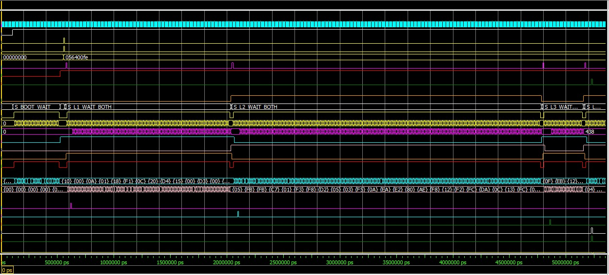
</p>

<p align="center">
  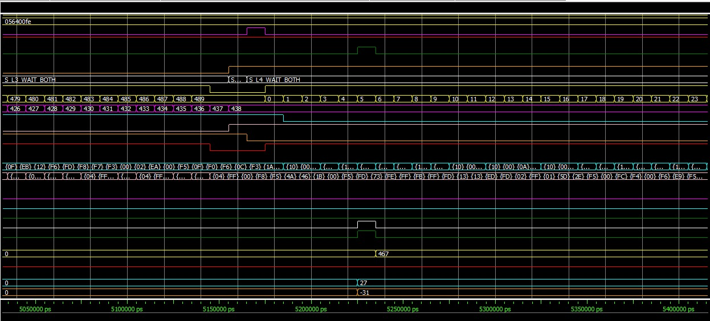
</p>

* **Bit-Exact Equivalence:** 100% decision match ($0/20$ divergences) with Mean Absolute Error ($\text{MAE} = 0$) relative to the Python fixed-point model.
* **Classification Coverage:** Validated across Autonomous Emergency Braking (AEB), Emergency Steering Avoidance, Normal Cruise, and Combined Reaction scenarios.

---

## Silicon Physical Implementation (Cadence Flow)

The physical realization was executed using the Cadence RTL-to-GDSII flow on GPDK 45nm standard cell technology.

<p align="center">
  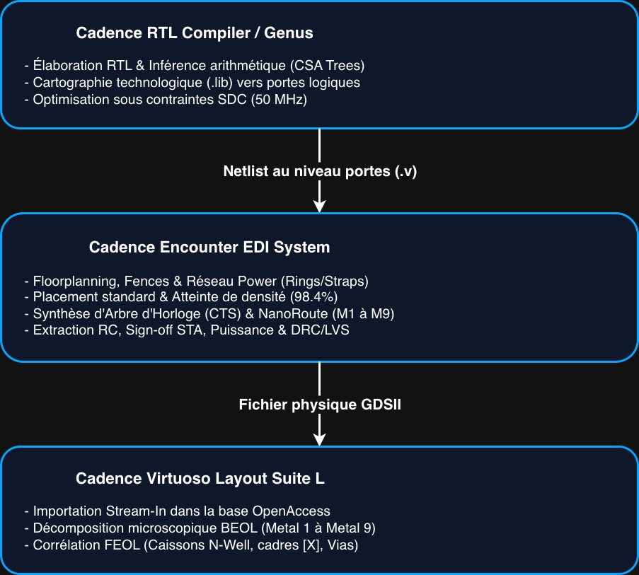
  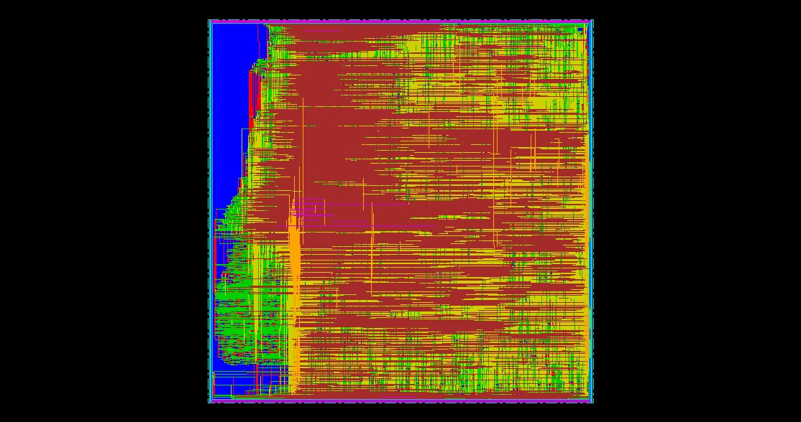
</p>

<p align="center">
  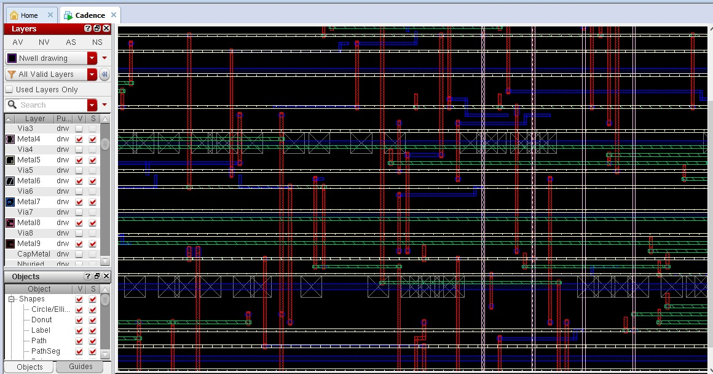
</p>

### Sign-off PPA Comparison (Synthesis vs. Place-and-Route)

| Metric | Logical Synthesis (Cadence Genus / RTL Compiler) | Physical Sign-off (Cadence Encounter & Virtuoso) |
| :--- | :--- | :--- |
| **Technology Node** | GPDK 45nm CMOS ($1.08\text{ V}$, Slow Corner) | GPDK 45nm CMOS, 1P9M ($1.08\text{ V}$, Slow Corner, $125^\circ\text{C}$) |
| **Target Clock** | $50.00\text{ MHz}$ ($T = 20\text{ ns}$) | $50.00\text{ MHz}$ ($T = 20\text{ ns}$) |
| **Total Instances** | $125,060$ active logic cells | **$379,783$ cells** ($127,900$ active + $251,883$ fillers) |
| **Equivalent Gate Count** | $125,060$ gates | **$444,158$ equivalent gates** (NAND2X1 ref) |
| **Die Dimensions** | Virtual wireload area | **$1004.955\ \mu\text{m} \times 1003.320\ \mu\text{m}$ ($1.008\text{ mm}^2$)** |
| **Core Density** | Unplaced estimate | **$98.426\%$** |
| **Setup Slack (WNS)** | $+12.780\text{ ns}$ | **$+6.239\text{ ns}$** (0 violations / $59,168$ paths) |
| **Hold Slack (WNS)** | Not modeled (Ideal clock) | **$+0.049\text{ ns}$** ($0\text{ ns}$ global, 0 violations) |
| **Clock Skew** | $0.0\text{ ps}$ (Ideal) | **$60.1\text{ ps}$** (7-level CTS tree, $18,310$ sinks) |
| **Maximum Operating Frequency ($F_{max}$)**| $138.50\text{ MHz}$ (Wireload estimate) | **$72.67\text{ MHz}$** ($T_{crit} = 13.761\text{ ns}$) |
| **Total Power Consumption** | $82.48\text{ mW}$ (Statistical wireload) | **$43.66\text{ mW}$** (Extracted RC netlist) |
| **Leakage Power** | $34.70\ \mu\text{W}$ | **$15.97\ \mu\text{W}$** |
| **DRC / LVS / Antenna Status** | Clean logic netlist | **0 Short, 0 Open, 0 LVS errors, 0 Antenna violations** |

---

## Repository Structure

```text
.
├── RTL/                         # Synthesizable RTL descriptions
│   ├── adas_accelerator_top.sv  # Top-level integration wrapper
│   ├── compute_core.sv          # Spatial computation matrix
│   ├── adder_tree_4.sv          # 4-input Carry-Save adder tree (Layer 1)
│   ├── adder_tree_8.sv          # 8-input Carry-Save adder tree (Layer 2)
│   ├── adder_tree_16.sv         # 16-input Carry-Save adder tree (Layers 3 & 4)
│   ├── fsm_controller.sv        # Deterministic sequencer
│   ├── timing_monitor.sv        # ISO 26262 watchdog hardware monitor
│   ├── weights_rom.sv           # Quantized weight ROM macro (490 Bytes)
│   ├── mem_controller.vhd       # Dual-bank Ping-Pong memory controller (VHDL)
│   └── spm_activations.vhd      # Activation scratchpad register bank (VHDL)
├── SIM/                         # Simulation environment & verification
│   ├── tb_adas_top.sv           # Modular self-checking testbench
│   ├── run_sim                  # Simulation launch script
│   ├── sensor_data.txt          # 20 real-world driving test vectors
│   └── weights.txt              # Hexadecimal quantized synaptic weights
├── SW/                          # Python machine learning framework
│   ├── dataset_adas.csv         # 160,000 synthetic driving scenarios
│   ├── best_model.pth           # Trained PyTorch model checkpoint
│   └── poids.py                 # Training & INT8 quantization script
├── backend/                     # ASIC physical implementation files
│   ├── constraints/
│   │   ├── adas_constraints.sdc # SDC timing constraints (50 MHz)
│   │   └── clk.spec             # CTS clock tree specification file
│   ├── scripts/
│   │   ├── syn_adas.tcl         # Cadence Genus synthesis script
│   │   └── init.tcl             # Cadence Encounter initialization script
│   ├── netlist/
│   │   └── adas_top_synth.v     # Structural gate-level netlist (Post-Synthesis)
│   └── reports/                 # Formal sign-off verification logs
│       ├── report_timing.rpt    # Static timing analysis report (Pre-layout)
│       ├── report_area.rpt      # Cell & area hierarchical report
│       ├── report_power.rpt     # Statistical power report
│       ├── adas_accelerator_top_postRoute.summary      # Setup sign-off summary
│       ├── adas_accelerator_top_postRoute_hold.summary # Hold sign-off summary
│       ├── adas_accelerator_top_cts.rpt                # CTS clock distribution log
│       ├── connectivity.rpt     # Formal LVS connectivity report (0 open/short)
│       ├── power_final.rpt      # Final power extraction report (43.66 mW)
│       └── summary_final.rpt    # 379,783 physical cell inventory report
└── docs/
    └── figures/                 # Layout captures, datapath schematics & waveforms
